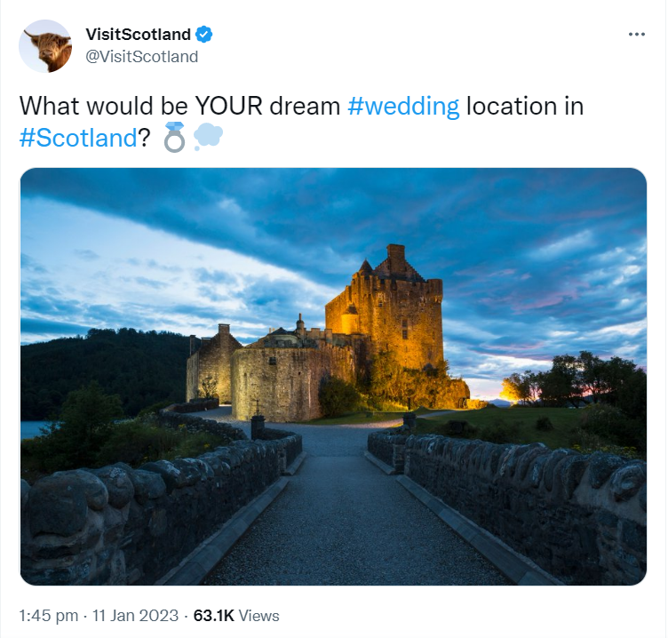

```{r setup, include=FALSE}
knitr::opts_chunk$set(echo = TRUE)
```

```{r, include = FALSE}
library(tidyverse)
library(here)
library(leaflet)
library(sf)
library(png)
library(htmltools)
library(RColorBrewer)
library(pals)

options(scipen = 999)
options(dplyr.summarise.inform = FALSE)
```

```{r, include = FALSE}
visit_theme <- theme(axis.text = element_text(size = 10),
                    plot.title = element_text(size = 14),
                    panel.grid.minor.y = element_blank())

visit_colour <- c("#650360", "#005EB8")
```

```{r, include = FALSE}
activities <- read_csv(here("clean data/activities.csv"))

locations <- read_csv(here("clean data/location.csv"))

travel <- read_csv(here("clean data/travel.csv"))

accomodation <- read_csv(here("clean data/accomodation.csv"))

demographics <- read_csv(here("clean data/demographics.csv"))

rdt <- st_read(here("clean data/regional_data.geojson"))
```


# Introduction

To help Visit Scotland with its goals of realising the potential of the tourism assets throughout Scotland we want to look at data on a range of topics such as;

* What types of activity are visited most and which generate the most revenue?
* What types of location are visited most and which generate the most revenue?
* What methods of transport do tourists use?
* What demographics of people make up the tourist population?
* Which counties of Scotland are most popular with tourists?

With a better understanding of these type of statistics we can understand what are is more or less popular and from there determine where further support may be required and where further development is needed. Using this Visit Scotland can work with private businesses, public agencies and local authorities to improve visitor experience and help various tourism assets reach their potential.

# Data

The data sets used are from statistics.gov.scot. Data was collected using a survey methodology and due to Covid-19 collection was disrupted in 2020 (bar accommodation data).

### _Activities, location, transport and demographic data_

This data was generated using over 35,000 interviews with adults over 16, resident in England, Wales and Scotland during weekly survery waves.

A tourism day trip is defined as taking part in a listed activity, which takes more than 3 hours out of the home and is not done regularly. The activity must not be done in the place of living or work (if started after work). Trips specifically to visitor attractions, live sporting events and special public events did not have to meet all of these criteria.

### _Accomodation data_

This data was produced from a survey completed by the accomodation provider. This survery is sent out monthly and participation of providers varies over time. Geographic locations are defined as follows;

* Large Urban Areas (settlements of over 125,000 people)
* Other Urban Areas (settlements of 10,000 to 124,999 people)
* Accessible Small Towns (settlements of 3,000 to 9,999 people and within 30 minutes drive of a settlement of 10,000 or more) 
* Remote Small Towns (settlements of 3,000 to 9,999 people and with a drive time of over 30 minutes to a settlement of 10,000 or more) 
* Accessible Rural (settlements of less than 3,000 people and within 30 minutes drive of a settlement of 10,000 or more) 
* Remote Rural (settlements of less than 3,000 people and with a drive time of over 30 minutes to a settlement of 10,000 or more)

15 rows only showed a low sample size of data (primarily small hotels and hostels), these will be discounted for the sake of using more reliable data.

### _Regional tourism data_

This data is gathered from surveys and looks at overnight trips taken for any purpose. Some 100,000 residents of Great Britain were contacted and those who had returned from an overnight trip in the past 4 weeks were asked to describe this trip, from which this data was generated.

# What kind of tourism activity generates the highest income for Scotland?

```{r, echo = FALSE}

activities <- activities %>% 
  mutate(gdp_spent_billions = gbp_spent/1000000000,
         visits_millions = visits/1000000)

activities %>% 
  filter(tourism_activity != "All") %>% 
  group_by(tourism_activity) %>% 
  summarise(total_income_billions = round(sum(gdp_spent_billions), digits = 3)) %>% 
  arrange(desc(total_income_billions)) %>%
  mutate(tourism_order = 1:n()) %>%
  mutate(tourism_order = as.character(tourism_order)) %>% 
  ggplot(aes(x = total_income_billions, y = fct_reorder(tourism_activity, total_income_billions), fill = forcats::fct_inorder(tourism_order))) +
  geom_col()+
  geom_text(aes(label = total_income_billions),
            nudge_x = 0.9,
            size = 3)+
  scale_fill_manual(values = rep(visit_colour, length.out = 15))+
  theme(legend.position = "none")+
  labs(x = "Total spend (£ billions)",
       y = "Type of tourism activity",
       title = "Total spent on activity")+
  visit_theme

```

The 3 activities that generate the most income for Scotland are eating out, shopping for items that would not generally be bought and visits with friends and family all with over £10 billion generated. This equates to over £1 billion per annum for each of these types of tourism income.

Following these, nights out, outdoor leisure and general days out all generated over £5 billion between 2013 and 2019.

# What kind of activity generates is the cause of the most visits to sites in Scotland?

```{r, echo = FALSE}

activities %>% 
  filter(tourism_activity != "All") %>% 
  group_by(tourism_activity) %>% 
  summarise(total_visits_millions = sum(visits_millions)) %>% 
  arrange(desc(total_visits_millions)) %>% 
  mutate(tourism_order = 1:n()) %>%
  mutate(tourism_order = as.character(tourism_order)) %>% 
  ggplot(aes(x = total_visits_millions, y = fct_reorder(tourism_activity, total_visits_millions), fill = forcats::fct_inorder(tourism_order))) +
  geom_col()+
  geom_text(aes(label = total_visits_millions),
            nudge_x = 15,
            size = 3) +
  scale_fill_manual(values = rep(visit_colour, length.out = 15))+
  theme(legend.position = "none")+
  labs(x = "Total visits (millions)",
       y = "Type of tourism activity",
       title = "Total visits to activity")+
  visit_theme

```


The largest reason for visits to sites in Scotland is visiting friends and family with over 300 million visits.

Following this going out for a meal and outdoor leisure activities were both identified as the reason for over 150 million visits.

General days out, nights out and shopping also accounted for more than 100 million visits each.

# What kind of activity generates the most spend per visit?

```{r, echo = FALSE}

activities %>% 
  mutate(spend_per_visit = gbp_spent / visits) %>% 
  filter(tourism_activity != "All") %>% 
  group_by(tourism_activity) %>% 
  summarise(average_spend_per_visit = round(median(spend_per_visit), digits = 2)) %>% 
  arrange(desc(average_spend_per_visit)) %>% 
  mutate(tourism_order = 1:n()) %>%
  mutate(tourism_order = as.character(tourism_order)) %>% 
  ggplot(aes(x = average_spend_per_visit, y = fct_reorder(tourism_activity, average_spend_per_visit), fill = forcats::fct_inorder(tourism_order))) +
  geom_col()+
  geom_text(aes(label = average_spend_per_visit),
            nudge_x = 6)+ 
  scale_fill_manual(values = rep(visit_colour, length.out = 15))+
  xlim(0,90)+
  theme(legend.position = "none")+
  labs(x = "Average spend per visit (£)",
       y = "Type of tourism activity",
       title = "Average spend by activity")+
  visit_theme  

```

When looking at the data by the amount spent per visit we can see that shopping for items that you do not regularly buy is highest. Following this meals and special personal events both generated over £50 per visit.

Activities with lower numbers of visits but a high spend per visit would be a good way to increase the income for tourism as a whole across Scotland. Shopping for items that aren't normally bought, special personal events and days out to beauty/health centres and spas all rank relatively low in terms of visits but generate a high spend per visit. Popularising Scottish wedding venues or health spas would be a good way to attempt to generate additional revenue as fewer visits would have a proportionally larger effect on overall income. 

Tweets such as the following may be a good idea to increase, showing beautiful wedding venues and planting the idea of a wedding in Scotland to people.



# What type of locations receive the most visits and where do people spend the most?

```{r, echo = FALSE}

locations %>% 
  filter(type_of_location_visited != "All areas") %>% 
  mutate(visits_millions = visits / 1000000) %>% 
  group_by(type_of_location_visited) %>% 
  summarise(total_visits_millions = sum(visits_millions)) %>% 
  arrange(desc(total_visits_millions)) %>% 
  mutate(tourism_order = 1:n()) %>%
  mutate(tourism_order = as.character(tourism_order)) %>% 
  ggplot(aes(x = total_visits_millions, y = fct_reorder(type_of_location_visited, total_visits_millions), fill = forcats::fct_inorder(tourism_order))) +
  geom_col()+
  geom_text(aes(label = total_visits_millions),
            nudge_x = 15,
            size = 3) +
  scale_fill_manual(values = rep(visit_colour, length.out = 15))+
  theme(legend.position = "none")+
  labs(x = "Total visits (millions)",
       y = "Type of Location",
       title = "Total visits to location")+
  visit_theme

```

Cities and large towns are the most visited locations in Scotland. The number of visits approximately lines up with the expected size/populations of the locations with some possible exceptions around seaside towns.  With visits friends and family being the top reason for tourism activities it makes sense that visits to the most populated areas would be most common.

```{r, echo=FALSE}

locations %>% 
  filter(type_of_location_visited != "All areas") %>% 
  mutate(spend_billions = gbp_spent / 1000000000) %>% 
  group_by(type_of_location_visited) %>% 
  summarise(total_spent_billions = sum(spend_billions)) %>% 
  arrange(desc(total_spent_billions)) %>% 
  mutate(tourism_order = 1:n()) %>%
  mutate(tourism_order = as.character(tourism_order)) %>% 
  ggplot(aes(x = total_spent_billions, y = fct_reorder(type_of_location_visited, total_spent_billions), fill = forcats::fct_inorder(tourism_order))) +
  geom_col()+
  geom_text(aes(label = total_spent_billions),
            nudge_x = 1,
            size = 3) +
  scale_fill_manual(values = rep(visit_colour, length.out = 15))+
  theme(legend.position = "none")+
  labs(x = "Total spent (£ billions)",
       y = "Type of Location",
       title = "Total spent in each location")+
  visit_theme

locations %>% 
  mutate(spend_per_visit = gbp_spent / visits) %>% 
  filter(type_of_location_visited != "All areas") %>% 
  group_by(type_of_location_visited) %>% 
  summarise(average_spend = round(median(spend_per_visit), digits = 2)) %>%
  arrange(desc(average_spend)) %>% 
  mutate(tourism_order = 1:n()) %>%
  mutate(tourism_order = as.character(tourism_order)) %>% 
  ggplot(aes(x = average_spend, y = fct_reorder(type_of_location_visited, average_spend), fill = forcats::fct_inorder(tourism_order))) +
  geom_col()+
  geom_text(aes(label = average_spend),
            nudge_x = 2,
            size = 3) +
  scale_fill_manual(values = rep(visit_colour, length.out = 15))+
  theme(legend.position = "none")+
  labs(x = "Average spend (£)",
       y = "Type of Location",
       title = "Average spent in each location")+
  visit_theme

```

By a considerable margin the most money is spent in cities and large towns. This is partially due to the fact that this is where most visits occur alongside the fact things are often more expensive in Cities leading to a higher spend per visit at almost £50. All other locations average a spend of between £29 and £36 per visit apart from Seaside - other which is down at £23. 

People appear to be more likely to spend more money in cities than other locations and understanding these different relative spends will be useful when assisting certain tourism assets in projecting potential revenues based on their location.

# Is there a particular method of travel visitors arrive by? 
```{r, echo=FALSE}
travel <- travel %>% 
  filter(method_of_travel != "All") %>% 
  mutate(visits_millions = visits / 1000000)

travel %>%
  group_by(method_of_travel) %>% 
  summarise(total_visits_millions = sum(visits_millions)) %>% 
  arrange(desc(total_visits_millions)) %>% 
  mutate(tourism_order = 1:n()) %>%
  mutate(tourism_order = as.character(tourism_order)) %>% 
  ggplot(aes(x = total_visits_millions, y = fct_reorder(method_of_travel, total_visits_millions), fill = forcats::fct_inorder(tourism_order))) +
  geom_col()+
  geom_text(aes(label = total_visits_millions),
            nudge_x = 20,
            size = 3) +
  scale_fill_manual(values = rep(visit_colour, length.out = 30))+
  theme(legend.position = "none")+
  labs(x = "Total visits (millions)",
       y = "Method of transport",
       title = "Total visits by each method of transport")+
  visit_theme

travel %>% 
  mutate(car_or_not = case_when(method_of_travel == "Car - hired" ~ "Car",
                                method_of_travel == "Car - own/friends/family" ~ "Car",
                                TRUE ~ "Not Car")) %>% 
  group_by(car_or_not) %>% 
  summarise(total_visits_millions = sum(visits_millions)) %>% 
  ggplot(aes(x = total_visits_millions, y = fct_reorder(car_or_not, total_visits_millions), fill = car_or_not)) +
  geom_col()+
  geom_text(aes(label = total_visits_millions),
            nudge_x = 20,
            size = 3) +
  scale_fill_manual(values = rep(visit_colour, length.out = 30))+
  theme(legend.position = "none")+
  labs(x = "Total visits (millions)",
       y = "Method of transport",
       title = "Total visits by each method of transport")+
  visit_theme

```

Car is far and away the most popular form of transport to arrive at these locations by. In fact there is almost double the amount of visits made by car than all other methods of transport combined. This is a good sign for many of the more remote tourism locations that are not serviced by public transport and the majority of the public's chosen method of transport will still allow them to reach these locations. 

The fourth most popular method of transport is walked. This indicates that a lot of tourism is local domestic tourism with people visiting areas within walking distance of where they live. However this data will also potentially include those on hiking holidays so will get people at both ends of the scale in terms of distances walked to reach a destination.

```{r, echo = FALSE}

travel %>% 
  mutate(public_or_not = case_when(method_of_travel == "Boat/Ship/Ferry" ~ "Public",
                                   method_of_travel == "Bus or Coach - Minibus" ~ "Public",
                                   method_of_travel == "Bus or Coach - Organised Tour" ~ "Public",
                                   method_of_travel == "Bus or Coach - Regular" ~ "Public",
                                   method_of_travel == "Plane" ~ "Public",
                                   method_of_travel == "Taxi" ~ "Public",
                                   method_of_travel == "Train" ~ "Public",
                                   method_of_travel == "Tram" ~ "Public",
                                   method_of_travel == "Tube" ~ "Public",
                                   TRUE ~ "Not Public"
                                   )) %>% 
  filter(public_or_not == "Public") %>% 
  group_by(method_of_travel) %>% 
  summarise(total_visits_millions = sum(visits_millions)) %>% 
  arrange(desc(total_visits_millions)) %>% 
  mutate(tourism_order = 1:n()) %>%
  mutate(tourism_order = as.character(tourism_order)) %>% 
  ggplot(aes(x = total_visits_millions, y = fct_reorder(method_of_travel, total_visits_millions), fill = forcats::fct_inorder(tourism_order))) +
  geom_col()+
  geom_text(aes(label = total_visits_millions),
            nudge_x = 5,
            size = 3) +
  scale_fill_manual(values = rep(visit_colour, length.out = 30))+
  theme(legend.position = "none")+
  labs(x = "Total visits by public transport (millions)",
       y = "Method of transport",
       title = "Total visits by each method of transport")+
  visit_theme

```

Within those people who traveled by public transport train and bus/coach (regular) were the most common transportation taken for visits to tourism activities. Working with major providers of public transport we may be able to find mutually beneficial arrangements that can increase use of their services to reach certain tourism assets, increasing the number of people accessing that asset as well. Discounts tickets and some sort of profit sharing agreement based on this could be financially beneficial to both parties.

# What type of accomodation is most popular?

```{r, echo=FALSE}

accomodation %>% 
  filter(location == "All" & weekday_weekend == "All", size_of_accommodation == "All") %>% 
  group_by(accommodation_type_and_occupancy, year) %>% 
  summarise(average_occupancy = median(percent_occupancy)) %>% 
  ungroup() %>% 
  ggplot(aes(x = year, y= average_occupancy, colour = accommodation_type_and_occupancy))+
  geom_line()+
  labs(x = "Year",
       y = "Average occupancy",
       title = "Average occupancy of different accommodation types",
       color = "Type of accommodation")+
  scale_x_continuous(breaks = 2011:2021)+
  visit_theme+
  theme(panel.grid.minor.x = element_blank(),
        axis.text.x = element_text(angle = 90, vjust = 0.5))+
  scale_colour_brewer(palette = "Set2")

```

The data is not available for the total number of stays in the various types of accommodation so occupancy rates will be used to judge popularity, with more occupied accommodation being deemed more popular than less occupied.

This is the only set of data which runs up to 2021. Due to the impact of Covid-19 this data has been severely impacted with very few stays in any kind of accommodation in 2020. While 2021 shows some level of recovery the majority of accommodation types do not appear to have fully recovered. The data used to answer any business questions will therefore be cut off at 2019 before these unprecedented disruptions took place.

The type of accommodation which shows the least impact to Covid-19 appears to be caravan and camping parks. With these being fully outdoors this type of accommodation will have seen less restrictions and possibly have been more able to stay open and seemed more attractive to prospective customers.

```{r}
accomodation_to_2019 <-  accomodation %>% 
  filter(year != 2021, year != 2022)

accomodation_to_2019 %>% 
  filter(location == "All" & weekday_weekend == "All", size_of_accommodation == "All") %>% 
  group_by(accommodation_type_and_occupancy) %>% 
  summarise(average_occupancy = median(percent_occupancy)) %>% 
  ggplot(aes(x = average_occupancy, y = accommodation_type_and_occupancy, fill = accommodation_type_and_occupancy))+
  geom_col()+
  geom_text(aes(label = average_occupancy),
            nudge_x = 4,
            size = 3) +
  scale_fill_manual(values = rep(visit_colour, length.out = 30))+
  theme(legend.position = "none")+
  labs(x = "Average occupancy (%)",
       y = "Type of accommodation",
       title = "Percentage occupancy of accommodation types")+
  visit_theme
```


Over the full data set across all sizes of accommodation and location bed occupancy is highest in hotels indicating these are the most popular place to stay. The corresponding bed occupancy data shows there are many rooms with multiple beds where not all are occupied and would be expected to always be lower.

With additional data (split geographically) it would be very beneficial to be able to see areas with high occupancy rates which could be somewhere which could sustain additional hotels to increase overall visits. Conversely areas with low occupancy rates may require more publicity which Visit Scotland could help provide to draw more people into the area, improving occupancy rates of hotels as well as visitor numbers for local tourism activities.

It would also be of interest to see how the occupancy runs throughout the year in various types of accommodation (and location). It would be expected that accommodation like camping and caravan parks could see a sharp decline over the winter period while this would not be as extreme for hotels.

# Is there a difference is which accomodation is popular at differenet locations?

```{r, echo=FALSE}

accomodation_to_2019 %>% 
  filter(location != "All") %>% 
  filter(weekday_weekend == "All", size_of_accommodation == "All") %>% 
  group_by(accommodation_type_and_occupancy, location) %>% 
  mutate(average_occupancy = median(percent_occupancy)) %>% 
  ggplot(aes(x = location, y = average_occupancy, group = accommodation_type_and_occupancy, colour = accommodation_type_and_occupancy))+
  geom_line()+
  visit_theme+
  theme(panel.grid.minor.x = element_blank(),
        axis.text.x = element_text(angle = 90, vjust = 0.5))+
    labs(x = "Type of accommodation",
       y = "Average occupancy",
       title = "Average occupancy of different accommodation types",
       color = "Accommodation type")+
  scale_colour_brewer(palette = "Set2")


```

There are significant difference in the occupancy percentages of different types of accommodation by location, however hotels remain the most popular accommodation type in all locations varying from 77% in large urban areas to 59% in remote small towns.

Self-catering units are the second most popular type of accommodation in accessible rural areas (55%) and the second least popular in remote small towns (40%). Demand for this accommodation type clearly varies significantly due to the location.

All types of accommodation have their highest occupancy rates in large urban areas apart from guest houses which seem to benefit from areas of lower population to generate higher occupancy rates. This may be due to lower competition outside of large urban areas or an increased desire for this type of accommodation in less populated locations. These show a peak in occupancy in other urban areas indicating this type of accommodation remains popular in towns, but more so in medium sized towns.

