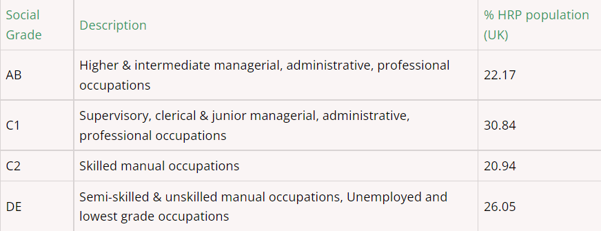

Load Libraries

```{r}
library(tidyverse)
library(here)
library(leaflet)
library(sf)
library(png)
library(htmltools)

options(scipen = 999)
```
Create theme

```{r}

visit_theme <- theme(axis.text = element_text(size = 10),
                    plot.title = element_text(size = 14),
                    panel.grid.minor.y = element_blank())

visit_colour <- c("#650360", "#005EB8")
#other colour to consider #211511

```

Load data
```{r}
activities <- read_csv(here("clean data/activities.csv"))

locations <- read_csv(here("clean data/location.csv"))

travel <- read_csv(here("clean data/travel.csv"))

accomodation <- read_csv(here("clean data/accomodation.csv"))

demographics <- read_csv(here("clean data/demographics.csv"))

rdt <- st_read(here("clean data/regional_data.geojson"))

```


# What kind of activity generates the highest income for Scotland?

```{r}

activities <- activities %>% 
  mutate(gdp_spent_millions = gbp_spent/1000000,
         visits_millions = visits/1000000)

activities %>% 
  filter(tourism_activity != "All") %>% 
  group_by(tourism_activity) %>% 
  summarise(total_income_millions = sum(gdp_spent_millions)) %>% 
  arrange(desc(total_income_millions))

activities %>% 
  filter(tourism_activity != "All") %>% 
  group_by(tourism_activity) %>% 
  summarise(total_income_millions = sum(gdp_spent_millions)) %>% 
  arrange(desc(total_income_millions)) %>%
  mutate(tourism_order = 1:n()) %>%
  mutate(tourism_order = as.character(tourism_order)) %>% 
  ggplot(aes(x = total_income_millions, y = fct_reorder( tourism_activity, total_income_millions), fill = forcats::fct_inorder(tourism_order))) +
  geom_col()+
  scale_fill_manual(values = rep(visit_colour, length.out = 15))+
  theme(legend.position = "none")+
  labs(x = "Total spend (£millions)",
       y = "Type of tourism activity",
       title = "Total spent on activity")+
  visit_theme

```
The 3 activities that generate the most income for Scotland are eating out, shopping for items that would not generally be bought and visits with friends and family all with over £10 billion generated each. This equates to over £1 billion per annum for each of these types of tourism income.

Following these nights out, outdoor leisure and general days out all generated over £5 billion between 2013 and 2019.

# What kind of activity generates is the cause of the most visits to sites in Scotland?

```{r}

activities %>% 
  filter(tourism_activity != "All") %>% 
  group_by(tourism_activity) %>% 
  summarise(total_visits_millions = sum(visits_millions)) %>% 
  arrange(desc(total_visits_millions))

activities %>% 
  filter(tourism_activity != "All") %>% 
  group_by(tourism_activity) %>% 
  summarise(total_visits_millions = sum(visits_millions)) %>% 
  arrange(desc(total_visits_millions)) %>% 
  mutate(tourism_order = 1:n()) %>%
  mutate(tourism_order = as.character(tourism_order)) %>% 
  ggplot(aes(x = total_visits_millions, y = fct_reorder(tourism_activity, total_visits_millions), fill = forcats::fct_inorder(tourism_order))) +
  geom_col()+
  scale_fill_manual(values = rep(visit_colour, length.out = 15))+
  theme(legend.position = "none")+
  labs(x = "Total visits (millions)",
       y = "Type of tourism activity",
       title = "Total visits to activity")+
  visit_theme

```
The largest reason for visits to sites in Scotland is visiting friends and family with over 300 million visits.

Following this going out for a meal and outdoor leisure activities were both identified as the reason for over 150 million visits.

General days out, nights out and shopping also accounted for more than 100 million visits each.

# What kind of activity generates the most spend per visit?

```{r}

activities %>% 
  mutate(spend_per_visit = gdp_spent_millions / visits_millions) %>% 
  filter(tourism_activity != "All") %>% 
  group_by(tourism_activity) %>% 
  summarise(average_spend_per_visit = mean(spend_per_visit)) %>% 
  arrange(desc(average_spend_per_visit))

activities %>% 
  mutate(spend_per_visit = gdp_spent_millions / visits_millions) %>% 
  filter(tourism_activity != "All") %>% 
  group_by(tourism_activity) %>% 
  summarise(average_spend_per_visit = median(spend_per_visit)) %>% 
  arrange(desc(average_spend_per_visit)) %>% 
  mutate(tourism_order = 1:n()) %>%
  mutate(tourism_order = as.character(tourism_order)) %>% 
  ggplot(aes(x = average_spend_per_visit, y = fct_reorder(tourism_activity, average_spend_per_visit), fill = forcats::fct_inorder(tourism_order))) +
  geom_col()+
  scale_fill_manual(values = rep(visit_colour, length.out = 15))+
  theme(legend.position = "none")+
  labs(x = "Average spend per visit",
       y = "Type of tourism activity",
       title = "Average spend by activity")+
  visit_theme  

```

When looking at the data by the amount spent per visit we can see that shopping for items that you do not regularly buy is highest. The days out to beauty/health centre/spas, meals and nights out all generated an average of over £50 per visit. 

Based on this analysis we should look to increase the number of trips people take to these type of tourism activities to help generate additional income throughout Scotland.

# What type of locations receive the most visits and where do people spend the most?

```{r}

locations %>% 
  filter(type_of_location_visited != "All areas") %>% 
  mutate(visits_millions = visits / 1000000) %>% 
  group_by(type_of_location_visited) %>% 
  summarise(total_visits_millions = sum(visits_millions)) %>% 
  ggplot(aes(x = total_visits_millions, y = fct_reorder(type_of_location_visited, total_visits_millions))) +
  geom_col()

locations %>% 
  filter(type_of_location_visited != "All areas") %>% 
  mutate(spend_millions = gbp_spent / 1000000) %>% 
  group_by(type_of_location_visited) %>% 
  summarise(total_spent_millions = sum(spend_millions)) %>% 
  ggplot(aes(x = total_spent_millions, y = fct_reorder(type_of_location_visited, total_spent_millions))) +
  geom_col()

locations %>% 
  mutate(spend_per_visit = gbp_spent / visits) %>% 
  filter(type_of_location_visited != "All areas") %>% 
  group_by(type_of_location_visited) %>% 
  summarise(average_spend = median(spend_per_visit)) %>% 
  ggplot(aes(x = average_spend, y = fct_reorder(type_of_location_visited, average_spend))) +
  geom_col()

```
Cities and large towns are the most visited locations in Scotland. The number of visits approximately lines up with the expected size/populations of the locations with some possible exceptions around seaside towns.  With visits friends and family being the top reason for tourism activities it makes sense that visits to the most populated areas would be most common.

By a considerable margin the most money is spent in cities and large towns. This is partially due to the fact that this is where most visits occur alongside the fact things are often more expensive in Cities leading to a higher spend per visit. All other locations average a spend of between £25 and £40 per visit.


# Is there a particular method of travel visitors arrive by? 

```{r}
travel %>% 
  filter(method_of_travel != "All") %>% 
  ggplot(aes(x = visits, y = fct_reorder(method_of_travel, visits))) +
  geom_col()

travel %>% 
  mutate(car_or_not = case_when(method_of_travel == "Car - hired" ~ "Car",
                                method_of_travel == "Car - own/friends/family" ~ "Car",
                                TRUE ~ "Not Car")) %>% 
  filter(method_of_travel != "All") %>% 
  ggplot(aes(x = visits, y = fct_reorder(car_or_not, visits))) +
  geom_col()

travel %>% 
  mutate(public_or_not = case_when(method_of_travel == "Boat/Ship/Ferry" ~ "Public",
                                   method_of_travel == "Bus or Coach - Minibus" ~ "Public",
                                   method_of_travel == "Bus or Coach - Organised Tour" ~ "Public",
                                   method_of_travel == "Bus or Coach - Regular" ~ "Public",
                                   method_of_travel == "Plane" ~ "Public",
                                   method_of_travel == "Taxi" ~ "Public",
                                   method_of_travel == "Train" ~ "Public",
                                   method_of_travel == "Tram" ~ "Public",
                                   method_of_travel == "Tube" ~ "Public",
                                   TRUE ~ "Not Public"
                                   )) %>% 
  filter(method_of_travel != "All") %>%
  filter(public_or_not == "Public") %>% 
  ggplot(aes(x = visits, y = fct_reorder(method_of_travel, visits))) +
  geom_col()

```

Car is far and away the most popular form of transport to arrive at these locations by. In fact there is almost double the amount of visits made by car than all other methods of transport combined.

Within those people who traveled by public transport train and bus/coach (regular) were the most common transportation taken for visits to tourism activities. 

_Something about walked being the 4th most popular mode of transport._

# What type of accomodation is most popular?

```{r}

accomodation %>% 
  filter(location == "All" & weekday_weekend == "All", size_of_accommodation == "All") %>% 
  group_by(accommodation_type_and_occupancy, year) %>% 
  summarise(average_occupancy = median(percent_occupancy)) %>% 
  ggplot(aes(x = year, y= average_occupancy, colour = accommodation_type_and_occupancy))+
  geom_line()

```

This is the only set of data which runs up to 2021. Due to the impact of covid-19 this data has been severely impacted with very few stays in any kind of accommodation in 2020. While 2021 shows some level of recovery the majority of accommodation types do not appear to have fully recovered. The data used to answer any business questions will therefore be cut off at 2019 before these unprecedented disruptions took place.

The type of accommodation which shows the least impact to covid-19 appears to be caravan and camping parks. With these being full outdoors this type of accommodation will have seen less restrictions and possibly have been more able to stay open and seemed more attractive to prospective customers.

```{r}

accomodation_to_2019 <-  accomodation %>% 
  filter(year != 2021, year != 2022)

accomodation_to_2019 %>% 
  filter(location == "All" & weekday_weekend == "All", size_of_accommodation == "All") %>% 
  group_by(accommodation_type_and_occupancy) %>% 
  summarise(average_occupancy = median(percent_occupancy)) %>% 
  ggplot(aes(x = average_occupancy, y = accommodation_type_and_occupancy))+
  geom_col()

```
The data is not available for the total number of stays in the various types of accommodation so occupancy rates will be used to judge popularity, with more occupied accommodation being deemed more popular than less occupied.

Over the full dataset across all sizes of accommodation and location bed occupancy is highest in hotels indicating these are the most popular place to stay. The corresponding bed occupancy data shows there are many rooms with multiple beds where not all are occupied and would be expected to always be lower.

With additional data it would be very beneficial to be able to see areas with high occupancy rates which could be somewhere which could sustain additional hotels to increase overall visits. It would also be of interest to see how the occupancy runs throughout the year in various types of accommodation. It would be expected that accommodation like camping and caravan parks would see a sharp decline over the winter period while this would not be as extreme for hotels.

# Is there a difference is which accomodation is popular at differenet locations?

```{r}

accomodation_to_2019 %>% 
  filter(location != "All") %>% 
  filter(weekday_weekend == "All", size_of_accommodation == "All") %>% 
  group_by(accommodation_type_and_occupancy, location) %>% 
  summarise(average_occupancy = mean(percent_occupancy)) %>% 
  ggplot(aes(x = average_occupancy, y = accommodation_type_and_occupancy))+ 
  geom_col()+
  facet_wrap(~location)

accomodation_to_2019 %>% 
  filter(location != "All") %>% 
  filter(weekday_weekend == "All", size_of_accommodation == "All") %>% 
  group_by(accommodation_type_and_occupancy, location) %>% 
  mutate(average_occupancy = median(percent_occupancy)) %>% 
  ggplot(aes(x = location, y = average_occupancy, group = accommodation_type_and_occupancy, colour = accommodation_type_and_occupancy))+
  geom_line()

accomodation_to_2019 %>% 
  filter(location != "All") %>% 
  filter(weekday_weekend == "All", size_of_accommodation == "All") %>% 
  group_by(accommodation_type_and_occupancy, location) %>% 
  summarise(average_occupancy = median(percent_occupancy)) %>% 
  arrange(desc(accommodation_type_and_occupancy), desc(average_occupancy))

```

There are significant difference in the occupancy precentages of different types of accommodation by location, however hotels remain the most popular accommodation type in all locations varying from 77% in large urban areas to 59% in remote small towns.

Self-catering units are the second most popular type of accommodation in accessible rural areas (55%) and the second least popular in remote small towns (40%). Demand for this accommodation type clearly varies significantly due to the location.

All types of accommodation have their highest occupancy rates in large urban areas apart from guest houses which seem to benefit from areas of lower population to generate higher occupancy rates. This may be due to lower competition outside of large urban areas or an increased desire for this type of accommodation in less populated locations. These show a peak in occupancy in other urban areas.


# Is there a particular demographic of visitors that we should be focusing on? Who spends the most and who visits the most?

```{r}

demographics <-  demographics %>% 
  mutate(gbp_spent_billions = gbp_spent/1000000000,
         visits_millions = visits/1000000,
         spend_per_visit = gbp_spent/ visits) %>% 
  group_by(category, type) %>% 
  mutate(total_spend = sum(gbp_spent_billions),
         total_visits = sum(visits_millions),
         median_spend_per_visit = median(spend_per_visit)) %>% 
  ungroup() %>% 
  arrange(category, type)
# can do all categories like the example below or as some form of grid
# demographics %>% 
#   filter(category == "access_to_car") %>% 
#   ggplot(aes(x = type, y = spend_per_visit))+
#   geom_col()

demographics %>% 
  ggplot(aes(x = type, y = gbp_spent_billions))+
  geom_col()+
  facet_grid(~category, scales = "free")+ 
  theme(axis.text.x = element_text(angle = 90, vjust = 0.5, size = 4))

demographics %>% 
  ggplot(aes(x = type, y = visits_millions))+
  geom_col()+
  facet_grid(~category, scales = "free")+
  theme(axis.text.x = element_text(angle = 90, vjust = 0.5, size = 4))

demographics %>% 
  ggplot(aes(x = type, y = spend_per_visit))+
  geom_col()+
  facet_grid(~category, scales = "free")+
  theme(axis.text.x = element_text(angle = 90, vjust = 0.5, size = 4))

demographics %>% 
  filter(category == "social_grade")

```

Access to a car shows a large effect on the amount of money spent (£31 billion to £5 billion) in a large part due to those in cars making over 4 times as many visits. The is also a difference in how much is spent in each visit with those individuals with access to a car spending a median of just over £40 compared to those without spending just under £30.

Age also shows some difference with the youngest and oldest groups spending the least and being some of the most frequent visitors. Those individuals between 25 and 44 spend the most of each visit with median values across all 3 groups over £300. 

When looking at whether individuals have children these people take almost 3 times as many trips and spend twice as much money as those without. However due to the increased size of group on the trip when children are involved the average spend per trip is higher.

Tracking by employment status we can see that those individuals with full/part time jobs spend almost 5 times as much as either those in education or unemployed and make around 5 times as many visits. They also spend more per visit at £44 per visit (£25 for those in education and £32 for those who are unemployed).

When analysing by gender males and females spend a relatively similar amount and make around as many visits with females being slightly higher in each category.

Looking at whether individuals are married or not the total spent is almost double for married individuals, perhaps indicative of more groups with others (spouse, family) as opposed to not married individuals. Married people take around 150 million trips more than unmarried people.

Examining social grade we can see that those in AB spend the most and take the most trips with individuals in C2 making the least trips and those in DE spending the least. This makes some sense when looking at the descriptions of these roles as it could be expected that those in grade AB would have more disposable income and free time in which to take these trips.




# What insights can we gain from regional tourism? Where are our visitors from and how does the money spent/ nights stayed and visits made compare?

```{r}
median_rdt %>% 
  filter(region_of_residence != "All of GB") %>% 
  group_by(region_of_residence) %>% 
  summarise(total_night_millions = sum(nights)/1000000,
            total_visit_millions = sum(visits)/1000000,
            total_spent_millions = sum(gbp_spent)/1000000) 
```
With the data for regional tourism only England and Scotland can truly be analysed as Wales is grouped with the rest of GB and due to rounding errors disappears in certain areas. This data is concerned with overnight trips for any purpose.

Comparing England and Scotland we can see that people from these two countries accounted for a very similar number of overnight visits to Scotland. However people from England tend to stay for more nights and spend more money.

```{r}

median_rdt <- rdt %>%
  filter(location != "Scotland") %>% 
  group_by(location, region_of_residence) %>% 
  mutate(average_nights_per_year_millions = median(nights)/1000000,
         average_visits_per_year = median(visits),
         average_spend = median(gbp_spent)) %>% 
  ungroup()

england_rdt <- median_rdt %>% 
  filter(region_of_residence == "England")

scotland_rdt <- median_rdt %>% 
  filter(region_of_residence == "Scotland")

```


```{r}
tag.map.title <- tags$style(HTML("
  .leaflet-control.map-title { 
    transform: translate(-50%,20%);
    position: fixed !important;
    left: 50%;
    text-align: center;
    padding-left: 10px; 
    padding-right: 10px; 
    background: rgba(255,255,255,0.75);
    font-weight: bold;
    font-size: 28px;
  }
"))

pal1 <- colorBin("YlOrRd", domain = england_rdt$average_nights_per_year_millions, bins = 7)

labels1 <- labels <- sprintf(
  "<strong>%s</strong><br/>%g Average nights (millions) stayed in region per year",
  england_rdt$location, england_rdt$average_nights_per_year_millions
) %>% lapply(htmltools::HTML)

title1 <- tags$div(
  tag.map.title, HTML("Average nights (millions) stayed in region per year by visitors from England")
)  

leaflet(england_rdt) %>%
  addTiles() %>% 
  addPolygons(fillColor = ~pal1(average_nights_per_year_millions),
              weight = 0.1,
              color = "white",
              fillOpacity = 1,
              label = labels1) %>% 
  addLegend(pal = pal1,
            values = ~average_nights_per_year_millions,
            position = "bottomleft",
            opacity = 1) %>% 
  setView(lat = 58.0000, lng = -5.0000, zoom = 5)%>% 
  addControl(title1, position = "topright", className = "map-title")

pal2 <- colorBin("YlOrRd", domain = scotland_rdt$average_nights_per_year_millions, bins = 7)

labels2 <- labels <- sprintf(
  "<strong>%s</strong><br/>%g Average nights (millions) stayed in region per year",
  scotland_rdt$location, scotland_rdt$average_nights_per_year_millions
) %>% lapply(htmltools::HTML)

title2 <- tags$div(
  tag.map.title, HTML("Average nights (millions) stayed in region per year by visitors from Scotland")
)  

leaflet(scotland_rdt) %>%
  addTiles() %>% 
  addPolygons(fillColor = ~pal2(average_nights_per_year_millions),
              weight = 0.1,
              color = "white",
              fillOpacity = 1,
              label = labels2) %>% 
  addLegend(pal = pal1,
            values = ~average_nights_per_year_millions,
            position = "bottomleft",
            opacity = 1) %>% 
  setView(lat = 58.0000, lng = -5.0000, zoom = 5) %>% 
  addControl(title2, position = "topright", className = "map-title")

```
We can see the most popular location for visitors from England is the city of Edinburgh (4.3 million nights stayed per year), with second and third being Highland (3.5 million nights stayed per year) and Glasgow city (2.8 million nights stayed per year). With these vistiors areas including East Dunbartonshire, East Renfrewshire, Midlothian, Clackmannanshire and West Dunbartonshire all average less than 100,000 nights stayed for visitors from England.

The highlands is the most common area to stay for visitors from Scotland (3.4 million night stayed per year) with Argyll and Bute (1.6 million nights stayed per year) and Perth and Kinross (1.3 million nights stayed per year) coming next. After this come Edinburgh and Glasgow (1.3 and 1.1 million nights stayed per year respectively). These are lower as expected with lots of the population of Scotland living in these areas they have less reason for overnight stays rather than at home.

East Renfrewshire, East Dunbartonshire, Midlothian, Clackmannanshire, East Ayrshire, Renfrewshire and South Lanarkshire all get less than 100,000 nights of visits on average each year.

```{r}

scotland_rdt %>% 
  arrange(desc(average_nights_per_year_millions))
```


# How have general tourism rates changed over time?

# Is there any way to predict spending and visits for Visit Scotland?
